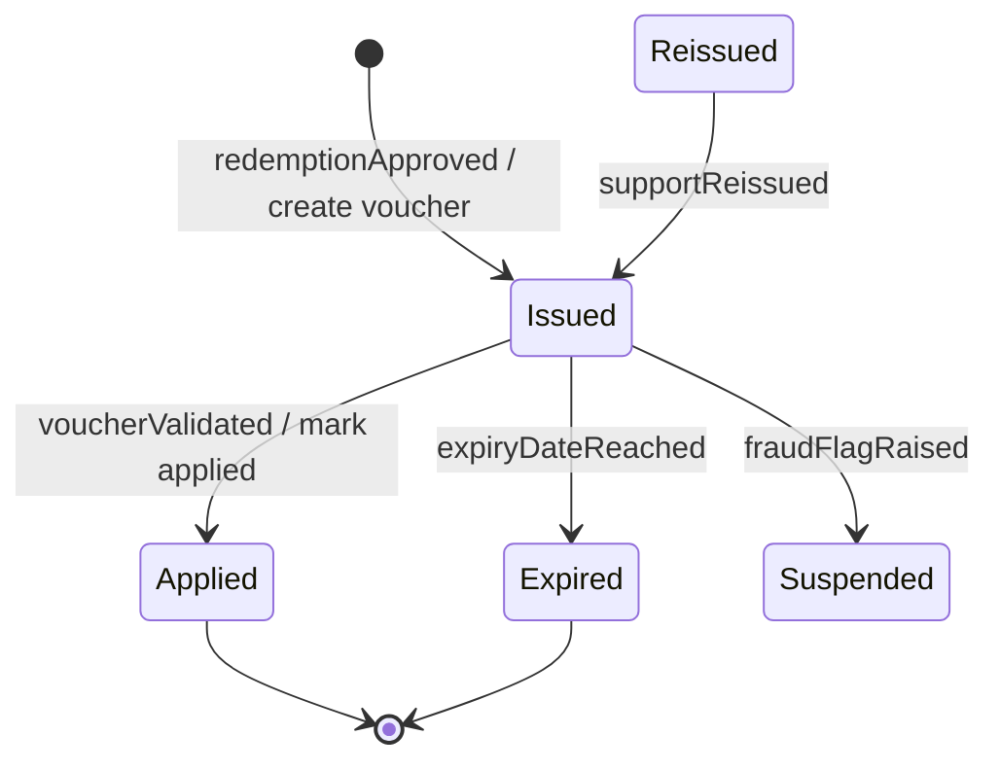

# State model: Voucher (draft)

```mermaid
stateDiagram-v2
  [*] --> Issued : redemptionApproved / create voucher
  Issued --> Applied : voucherValidated / mark applied
  Issued --> Expired : expiryDateReached
  Issued --> Suspended : fraudFlagRaised
  Reissued --> Issued : supportReissued
  Applied --> [*]
  Expired --> [*]
```
